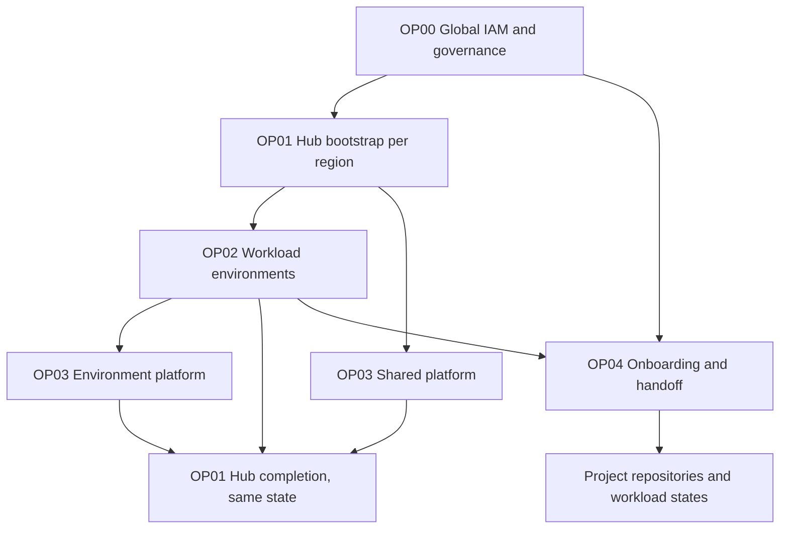

# OCI Landing Zone Reference Implementation

Our reference implementation of the [Operations Advisory Landing Zone
Repository Design](https://github.com/oracle-devrel/technology-engineering/tree/OperationsAdvisory-repository-design/oci-and-db/foundation/operations-advisory/multi-cloud-operating-models/landing-zone-repository-design).

Use it to implement reusable operations aligned with **what changes, who operates
it, and where its resources are managed**. It includes a Jsonnet projection of
the official Operating Entities blueprint, independent regional stacks,
dependency preparation, project onboarding/handoff and credential-free tests.

## Start here

Requirements for source generation: Python 3.10+, Git and Jsonnet 0.20+.

```bash
python3 scripts/reference.py generate --output generated
python3 scripts/reference.py validate --generated generated
python3 -m unittest discover -s tests -v
python3 scripts/check_contract.py --generated generated
```

Generation fetches and verifies the immutable OE commit in
[upstream.lock.json](upstream.lock.json). The checked-in example is synthetic;
replace it with a reviewed source model in a customer-controlled private
repository before deployment. Keep generated configurations separate from
their source and use a new output directory for each revision.

This reference replaces the repository's earlier single-region preview. Its
state boundaries and handoff format differ: existing installations must follow
the [migration procedure](docs/migration.md), rather than apply these generated
configurations over their previous states.

## Import from Landing Zone Studio

Use [Studio](https://oci-landing-zones.github.io/oci-landing-zone-operating-entities/)
to design the supported Hub B/CIS1/oc1 baseline, then import its ZIP:

```bash
python3 scripts/reference.py import-studio \
  --source customer/studio-fra.zip \
  --home-region eu-frankfurt-1 --landing-zone-environment shared \
  --notification-email operations@example.com \
  --output generated/studio-revision-001
```

Replace the example email with your approved operations address. Import checks
the exported JSON against the pinned generator, preserves CIDRs/subnets/project
NSGs, and produces operation configurations, source evidence and an import
report. Review the reported ownership/control adjustments before deployment.
Other hubs, CIS2, environment Security Zones and workload extensions are
explicitly rejected in this first version. See [Studio import](docs/studio-import.md).

The [private workflow](templates/workflows/stack-plan-apply.yml) offers `model`
or `studio` as the configuration source. The intended architecture is
**Studio design → reference foundation deployment → MCCP project self-service**;
the MCCP request/handoff integration still needs implementation and end-to-end
validation. See [integration boundaries](docs/studio-mccp-flow.md).

## Operations

| Operation | Scope and owner | Configuration/state boundary |
| --- | --- | --- |
| **OP.00 Global Landing Zone** | Cloud Operations / IAM governance | `common/`: all IAM, global governance, Cloud Guard, root Security Zone and home-region events |
| **OP.01 Landing Zone Environment** | Cloud Operations / network and security | `lze_<environment>/<region>/`: hub, DRG/routing, firewall and shared regional monitoring/security |
| **OP.02 Environment** | Environment operation, with Cloud Operations as configuration writer in this example | `workload_<environment>/<region>/`: spoke/attachment and its scanning, logs, topics, alarms and events |
| **OP.03 Platform** | Platform operation; IAM remains governed by Cloud Operations | `platform_<name>/` under the owning LZ/workload environment: dedicated network, attachment and platform monitoring |
| **OP.04 Project** | Cloud Operations | Update project IAM in `common/`, then publish the reviewed handoff; optional regional project baseline is a separate extension |
| **Project execution** | Project team inside its handoff | Separate private prod/non-prod repositories and workload states |

An OP is repeatable; it can have many instances. Stack count follows operations,
environments, regions and ownership. A VCN name alone does not determine it.

## Implemented example

- One shared Landing Zone environment with an OCI Network Firewall **Hub B**.
- Two regions: Frankfurt as the example home region and Amsterdam as a secondary
  region. No assumption that the secondary region is a complete DR solution.
- `prod` and `dev` workload environments, each with its own state in each region.
- Shared `ops` and prod `data` platforms with their own network/observability
  footprint in each region. Application/database services are explicit platform
  extensions; these examples do not provision Exadata or a runner VM.
- One `shop` project per workload environment; IAM is consolidated in OP00.
- **11 states and 13 complete configuration sets.** Hub bootstrap and completion
  share the same two hub states. Handoff publication has no Terraform state.



## Customer adoption

1. Agree operation ownership, IAM governance and the home/regional split using
   [the operating model](docs/operating-model.md).
2. Review the source model and generate the private configuration set using
   [generation and dependencies](docs/generation-and-dependencies.md).
3. Use [Resource Manager](docs/resource-manager.md) with private Object Storage,
   or the [Terraform CLI runtime](docs/terraform-cli.md) in an approved private
   pipeline. Each job manages one selected stack; no cascading applies.
4. Follow [project onboarding](docs/project-onboarding.md) and
   [Day 2 operations](docs/day2.md). For an existing Landing Zone, use
   [the migration procedure](docs/migration.md).

Code, reference examples and offline tests are public. Customer configuration,
runtime outputs and privileged execution belong in the customer's private
installation. The public workflow runs no cloud deployment.

## Validation status

The automated checks cover deterministic generation, operation ownership,
global/regional isolation, state/output uniqueness, dependency conflicts,
firewall/DRG binding and project handoff boundaries. They also compare generated
top-level families with the pinned Orchestrator facade.

Terraform plan/apply, traffic isolation, firewall completion and migration/rollback
are **pending validation in an OCI test tenancy**. See
[validation and scope](docs/validation.md) for the exact limits. The security
projection is an explicit initial baseline; this repository does not claim a
complete CIS certification. See [the design](docs/design.md) and
[upstream provenance](docs/upstream.md).

Licensed under [UPL 1.0](LICENSE). Reused resource definitions remain owned by
the OCI Landing Zones upstream projects.
