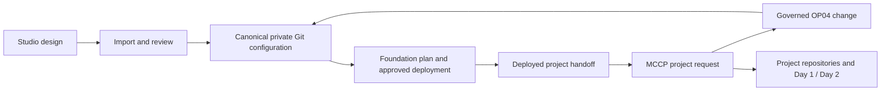

# Studio, foundation deployment and MCCP self-service

[Back to README](../README.md)

## Responsibilities

| Component | Owns |
| --- | --- |
| Studio | Initial visual design and export of a supported Landing Zone |
| Private foundation configuration repository + this reference | Approved design, OP00–OP04 preparation, IAM/network/platform ownership, regional states and deployment evidence |
| MCCP | Governed project requests and project Day 1/Day 2 operations within the published handoff |
| Orchestrator/Terraform | Actual infrastructure execution behind reviewed automation |

The intended flow is:

MCCP should request OP04 from foundation automation rather than create another
IAM/state owner. Foundation publishes a handoff only after the actual resources
and permissions exist. Project executors consume allowed compartments/networks
and never acquire the foundation executor's privileges.

## What simplifies operation

- Studio replaces hand editing during initial design; normal Git changes remain
  the source of truth after import.
- Foundation changes have explicit operation/region/state boundaries.
- Project teams use self-service without editing hub routing or global IAM.
- A single versioned request/handoff contract connects the components.

## Integration still required

The importer is implemented; the complete MCCP connection is not. The current
reference-owned version-1 handoff is not the MCCP machine handoff. We must
implement and test request routing, approvals, deployed output mapping,
repository layout, service catalog, retirement and status/error feedback against
the actual MCCP consumer. Do not infer compatibility from the artifact filename.

Imported Studio project NSGs initially remain owned by OP02. A project operation
must not also own those same NSGs. Either request their governed changes from
OP02, or explicitly migrate their ownership before enabling project NSG
self-service. This decision belongs to the customer operating model.

For consolidated IAM, onboarding is an OP04 operation executed against common;
there is no invented separate OP04 IAM state. Handoffs should record the real
state owners and deployment evidence. Reimporting an older Studio design must
not discard projects subsequently added through self-service.

This architecture adds an adapter and contract maintenance, while simplifying
the user workflow. It would become harder to operate if Studio, foundation and
MCCP each maintained independently editable copies or duplicate state owners.
