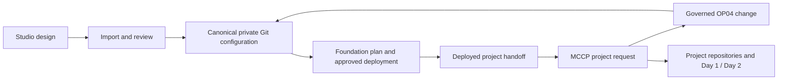

# Studio, foundation deployment and MCCP self-service

[Back to README](../README.md)

## Responsibilities

| Component | Owns |
| --- | --- |
| Studio | Initial visual design and export of a supported Landing Zone |
| Private foundation configuration repository + this reference | Approved design, OP00–OP04 preparation, IAM/network/platform ownership, regional states and deployment evidence |
| MCCP | Governed project requests and project Day 1/Day 2 operations within the published handoff |
| Orchestrator/Terraform | Actual infrastructure execution behind reviewed automation |

The intended flow is:



MCCP should request OP04 from foundation automation rather than create another
IAM/state owner. Foundation publishes a handoff only after the actual resources
and permissions exist. Project executors consume allowed compartments/networks
and never acquire the foundation executor's privileges.

## What simplifies operation

- Studio replaces hand editing during initial design; normal Git changes remain
  the source of truth after import.
- Foundation changes have explicit operation/region/state boundaries.
- Project teams use self-service without editing hub routing or global IAM.
- A single versioned request/handoff contract connects the components.

## Established MCCP contract

The handoff format and project NSG ownership are already defined in
[`multicloud-control-plane/oci-landing-zone`](https://github.com/multicloud-control-plane/oci-landing-zone/tree/9b4033267af881e65fe8c2b212f220b2804cac09),
reviewed on 2026-10-06. Reuse that contract when connecting this reference.

| Boundary | Established contract |
| --- | --- |
| Machine handoff | `project-foundation-handoff.json`, `schema_version: 3`; distinct project root, Application, Database and Infrastructure compartment OCIDs, VCN and four subnet roles: `web`, `app`, `database`, `infrastructure` |
| Evidence | Source repository/workflow/run/commit and actual OP02/OP04 state keys; no credentials |
| Repository routing | `nonprod-<project>` with `shared-nonprod-v2` for dev/test/uat; `prod-<project>` with `production` for prod |
| Human handoff | `environments/<environment>/environment_information.md` |
| Project ownership | Compute in APP, ADB in DB, project NSGs in INFRA; project GitOps owns the NSG lifecycle |
| Foundation ownership | OP02 owns shared VCN/subnets and excludes project NSGs |

The
[handoff renderer](https://github.com/multicloud-control-plane/oci-landing-zone/blob/9b4033267af881e65fe8c2b212f220b2804cac09/scripts/render_project_handoff.py)
defines schema 3. The
[onboarding contract](https://github.com/multicloud-control-plane/oci-landing-zone/blob/9b4033267af881e65fe8c2b212f220b2804cac09/.github/project-onboarding-contract.json)
is separately versioned as `contract_version: 4` and defines request naming and
repository routing. These version numbers refer to different contracts.

The
[operation adapter](https://github.com/multicloud-control-plane/oci-landing-zone/blob/9b4033267af881e65fe8c2b212f220b2804cac09/config/render.libsonnet)
removes project NSGs from OP02. Its runner policies grant NSG management in the
environment PROJECTS subtree and condition shared-VCN management on
`CreateNetworkSecurityGroup`/`DeleteNetworkSecurityGroup`. Human access follows
the official TBAC add-on through the
[TBAC adapter](https://github.com/multicloud-control-plane/oci-landing-zone/blob/9b4033267af881e65fe8c2b212f220b2804cac09/config/tbac.libsonnet).
The environment-wide runner scope is an explicit MVP choice, as described in
the [architecture](https://github.com/multicloud-control-plane/oci-landing-zone/blob/9b4033267af881e65fe8c2b212f220b2804cac09/docs/architecture.md).

## Implemented reference adapter

Generation reuses the pinned MCCP TBAC adapter and official OE add-on for
APP/DB/INFRA compartments, groups, tags and generic policies in common. Both
Studio and model sources emit separate project NSG seeds, excluded from OP02.
Onboarding and retirement update the common declaration and project seeds.

`reference.py handoff` reuses the pinned schema-3 renderer. It requires deployed
outputs and source provenance, checks the hierarchy and assigned network, and
produces the canonical Markdown plus a bound project NSG manifest. See
[project onboarding](project-onboarding.md) for commands and publication order.

## MCCP installation and consumer gate

Select this reference as the private foundation's generator and OP04 engine.
Keep the project's existing MCCP catalogs, templates and Platform CI workflow.
The optional UI's environment handoff reader receives the same Markdown contract.
The UI continues operating already handed-off projects; Cloud Operations handles
foundation onboarding and publication.

The earlier Cloud Operator `validate-handoff.py` fixes the old MVP state keys.
For this foundation use the provided consumer gate with the protected generated
catalog from the reviewed foundation revision:

```bash
python3 scripts/reference.py validate-handoff \
  --generated generated/revision-002 \
  --handoff-json handoffs/dev-billing-fra/project-foundation-handoff.json \
  --handoff-markdown handoffs/dev-billing-fra/environments/dev/environment_information.md \
  --source-repository example/private-foundation
```

It validates schema 3, project/region/repository routing, source repository,
distinct targets and matching Markdown; state provenance must match the actual
catalog owners. OP04 records `common/terraform.tfstate`; OP02 records
`workload_<environment>/<region>/terraform.tfstate`. Configure the selected
Cloud Operator installation to call these model/onboarding/handoff commands and
this gate. The old foundation's installation is not changed by installing the
reference, and its validator still applies to its own state layout.

For existing deployments, transfer NSG state ownership and review any compartment
move before publishing the project seed. Do not deploy a seed over NSGs already
owned by foundation. Offline tests cover generation, binding and consumer
contracts; effective IAM, create/update/delete, traffic and full retirement still
require OCI test-tenancy acceptance.

For consolidated IAM, onboarding is an OP04 operation executed against common;
there is no invented separate OP04 IAM state. Handoffs should record the real
state owners and deployment evidence. Reimporting an older Studio design must
not discard projects subsequently added through self-service.

This architecture adds an adapter and contract maintenance, while simplifying
the user workflow. It would become harder to operate if Studio, foundation and
MCCP each maintained independently editable copies or duplicate state owners.
